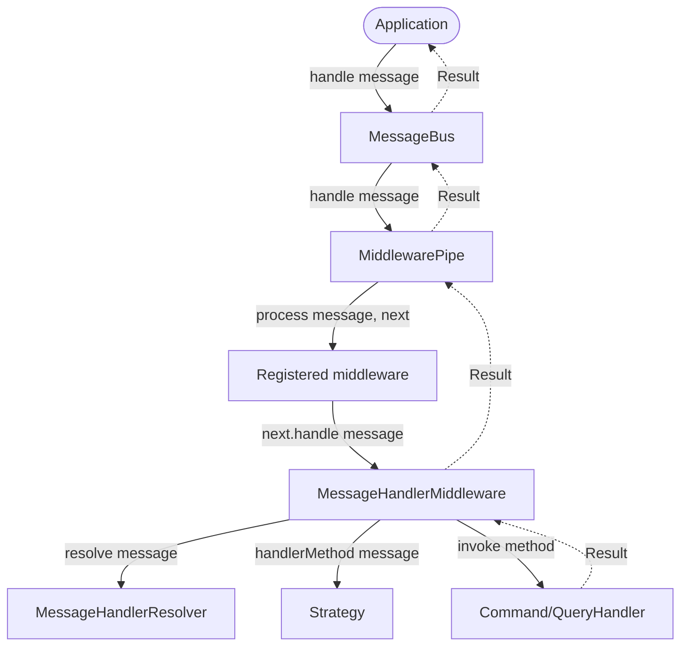
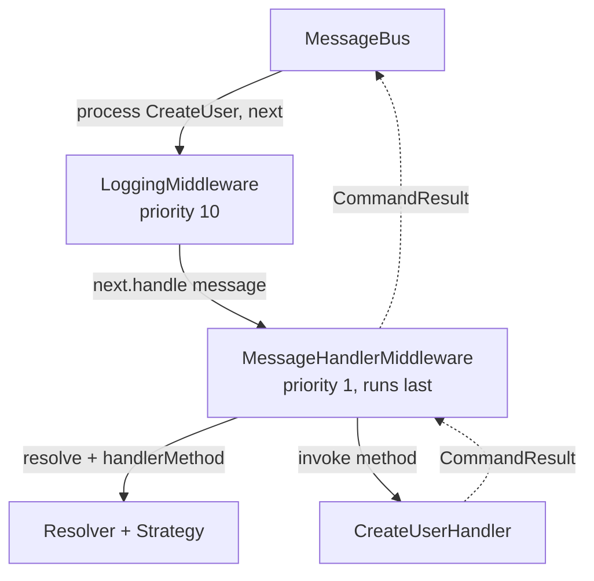

# Execution Flow

Solid arrows below are the message travelling forward through the pipeline, in priority order; dashed
arrows are the result on its way back. A result doesn't exist until `MessageHandlerMiddleware` resolves
the handler, asks the wired strategy which method to call, and invokes it. The result returns directly
to the caller from there. Notice no dashed arrow ever touches earlier middleware, since it has no part
on that side.

GitHub renders Mermaid diagrams as scalable SVG, so you can zoom in (browser zoom, or pinch/scroll on
the diagram) for a closer look. Each diagram below is also wrapped in a collapsible `
` block
and laid out top-to-bottom so it stays readable without needing to scroll sideways.

## Overview

Expand/collapse diagram

`MessageHandlerMiddleware` is just the last entry in the pipeline (lowest default priority), so any
middleware you register runs before the handler is resolved.

## Custom middleware example

Using the `LoggingMiddleware` from [Writing custom middleware](./usage-examples.md#writing-custom-middleware),
registered at priority `10` (above `MessageHandlerMiddleware`'s default priority of `1`):

Expand/collapse diagram

